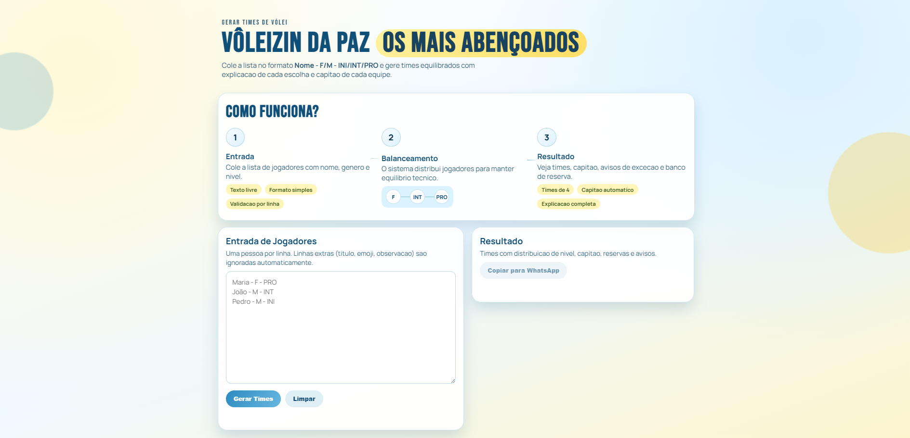
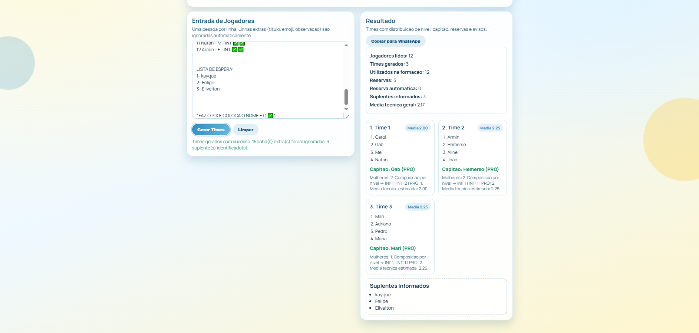

# Volleyball Team Generator

### Volleyball Team Generator

A web application for generating balanced volleyball teams from text-based player lists, including WhatsApp-style messages with extra information such as location, time, PIX details, and waiting lists.

[](https://developer.mozilla.org/pt-BR/docs/Web/HTML)
[](https://developer.mozilla.org/pt-BR/docs/Web/CSS)
[](https://developer.mozilla.org/pt-BR/docs/Web/JavaScript)
[](https://vercel.com/)

## About

This project was created to make volleyball meetup organization easier by turning a raw text list into 4-player teams with balanced skill distribution and clear warnings whenever a rule cannot be fully satisfied.

Production: https://generate-volleyball-team.vercel.app/

## 🚀 Used technologies

- HTML5
- CSS3
- Vanilla JavaScript
- Vercel for deployment

## 🎯 Features

- Reads players in the format Name - F/M - INI/INT/PRO
- Supports noisy WhatsApp-style messages
- Automatically ignores title, schedule, address, PIX, and note lines
- Detects reserves, substitutes, and waiting list sections
- Generates teams with 4 players each
- Prioritizes technical balance across teams
- Tries to ensure at least 1 woman per team whenever feasible
- Tries to ensure INI, INT, and PRO representation in each team whenever feasible
- Automatically assigns a captain
- Displays an explanation for each team composition
- Lets users copy the final result to WhatsApp

## ⌨️ Prerequisites

To run locally, you only need a modern browser.

### 🎉 Start the project

```bash
# clone the repository
git clone https://github.com/eliveltonsf/generate-volleyball-team.git

# enter the project folder
cd generate-volleyball-team
```

After that, open the index.html file in your browser.

If you prefer, you can also access the live version:

https://generate-volleyball-team.vercel.app/

## 📋 How to use

1. Open the application.
2. Paste the player list into the input field.
3. Click Generate Teams.
4. Review teams, captains, averages, and warnings.
5. Use the Copy to WhatsApp button to share the result.

### Input format

```text
Name - F - PRO
Name - M - INT
Name - F - INI
```

### Quick example

```text
Mari - F - PRO
Carol - F - INT
Mel - F - INI
Gab - M - PRO
Aline - F - INI
Hemerso - M - PRO
Adriano - M - INI
João - M - PRO
Pedro - M - INT
Maria - M - PRO
Natan - M - INT
Armin - F - INT
```

## 🤖 Copilot Agents

This project already includes ready-to-use agents and prompts to improve the application inside VS Code with Copilot Chat.

### Available agents

- Volleyball Team Builder
  - Focused on UI, responsiveness, user experience, and the full application logic.
- Volleyball Balance Engine
  - Focused on parsing, validation, balancing rules, reserves, and captain selection.

### Agent files

- .github/agents/volleyball-team-builder.agent.md
- .github/agents/volleyball-balance-engine.agent.md
- .github/prompts/gerar-times-volei.prompt.md

### How to use with Copilot

1. Open the project in VS Code.
2. Open Copilot Chat.
3. Enable Agent mode.
4. Choose the most suitable agent for the task.
5. Describe the rule or improvement you want.

### Prompt ideas

- Adjust the parser to accept more WhatsApp list variations without false validation errors.
- Improve balancing when there are not enough PRO players for all teams.
- Reorganize the mobile interface while keeping the beach-inspired visual style.

## 📸 Pictures

### Home



### Generated result



## 📁 Project structure

```text
.
├─ index.html
├─ styles.css
├─ script.js
├─ vercel.json
├─ README.md
└─ assets/
   └─ screenshots/
      ├─ tela-inicial.png
      └─ resultado-gerado.png
```

## 📱 Responsive

The interface was designed to work well on both desktop and mobile, with a focus on fast list reading, clear feedback, and visuals adapted to smaller screens.

<hr>

Made with 🧡 By Elivelton Ferreira. [Get in touch!](https://www.linkedin.com/in/eliveltonsf/) :calling:
